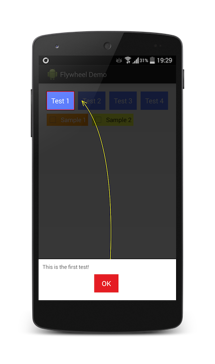

Intro Layout
===
The missed `IntroLayout` for Android!



Features
===
- Arrow cursor drawer
- Animate on target view
- Full control over targets
- Highly customizable!

Usage
===
... (be patient)

Compatibility
===
Currently compatible with API Level 11+
(will made compatible with 7+ in near future with the help of God).

License
===
```
Copyright 2014 semsamot

Licensed under the Apache License, Version 2.0 (the "License");
you may not use this file except in compliance with the License.
You may obtain a copy of the License at

   http://www.apache.org/licenses/LICENSE-2.0

Unless required by applicable law or agreed to in writing, software
distributed under the License is distributed on an "AS IS" BASIS,
WITHOUT WARRANTIES OR CONDITIONS OF ANY KIND, either express or implied.
See the License for the specific language governing permissions and
limitations under the License.
```
